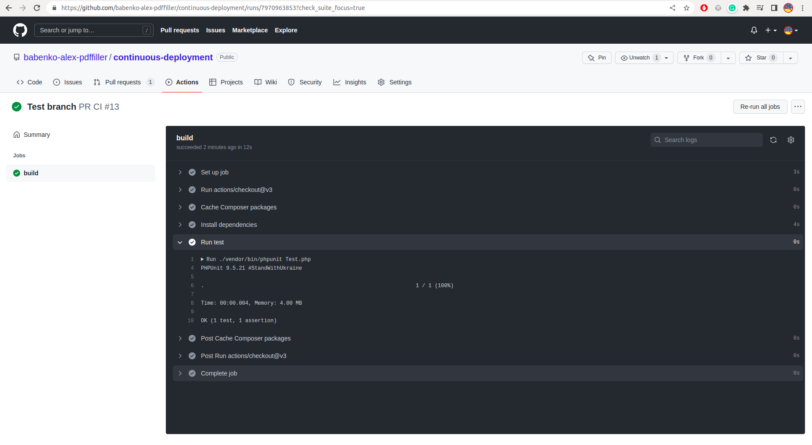
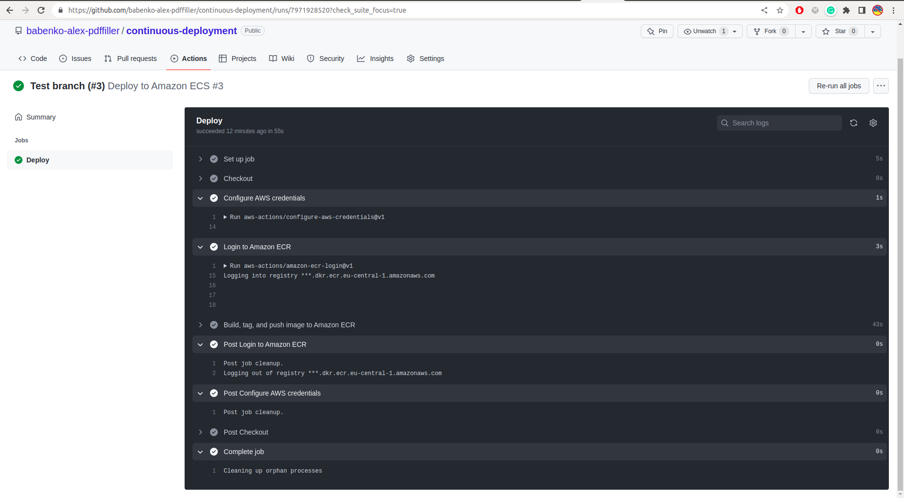
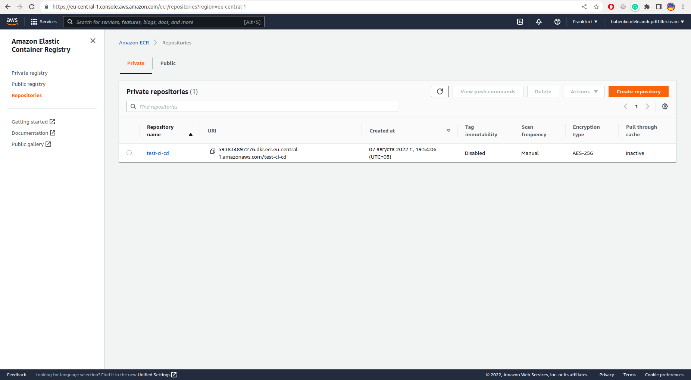
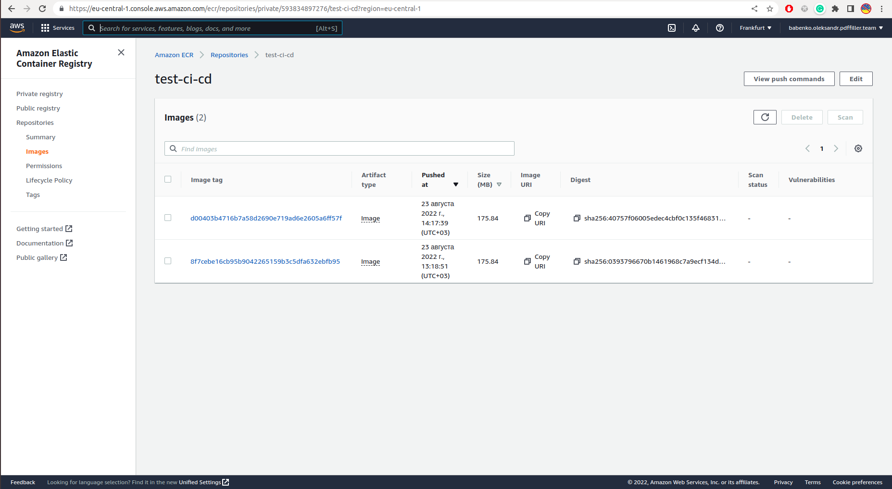

# continuous-deployment
Example of setup CI/CD for project

#### Logs of ci actions (trigger on pull request changes) 

#### Logs of cd actions (trigger on push to master)

#### Example AWS ECR instance

#### ECR logs

